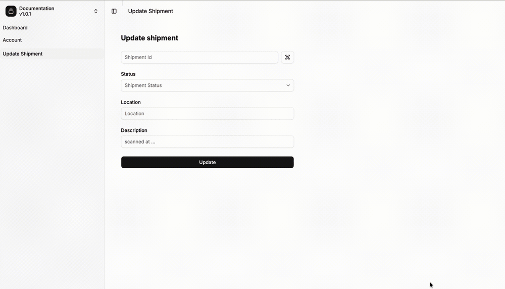
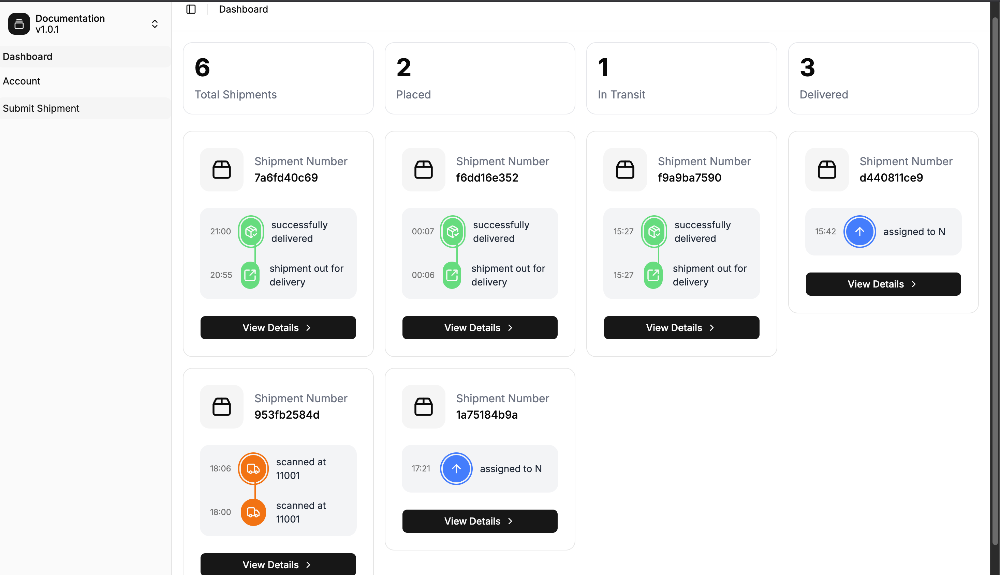
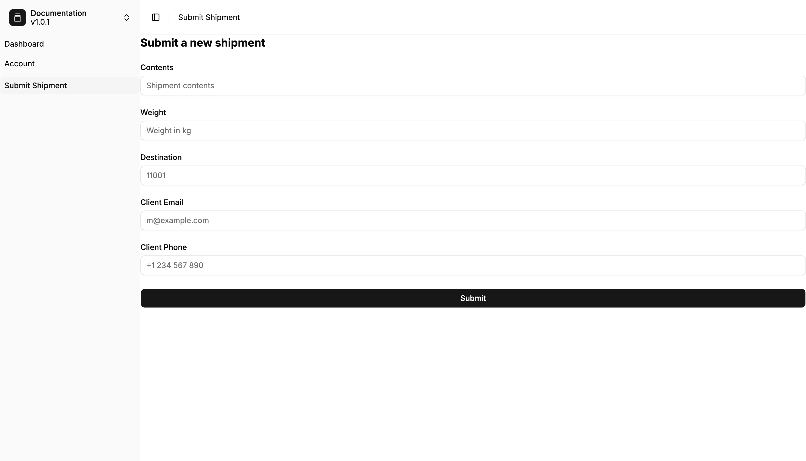
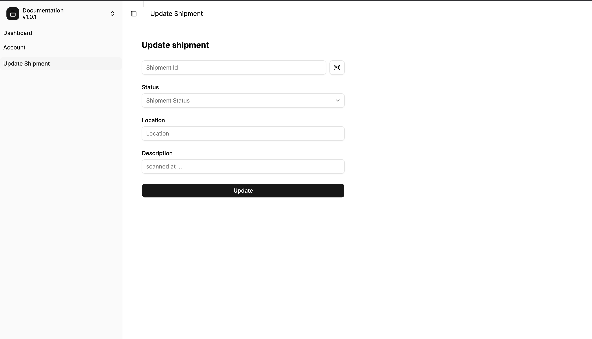

# 📦 FastShip

**A delivery management platform for sellers and delivery partners** — submit a shipment, and it's automatically routed to a delivery partner who services the destination. Everyone stays in the loop with a live tracking timeline, email + SMS notifications, and a shareable public tracking link.

<p align="center">
  
</p>

---

## Why FastShip

Small sellers shouldn't have to babysit deliveries. With FastShip a seller drops in a package's details and the system does the rest:

- **Auto-assignment** — every shipment is matched to a delivery partner who both *services the destination zip code* and has *spare handling capacity*. No manual dispatch.
- **A single source of truth** — each status change (placed → in transit → out for delivery → delivered) is appended to an immutable timeline that sellers, partners, and end customers can all read.
- **Customers stay informed automatically** — email and SMS notifications fire on key events, and a public tracking page can be shared with the recipient — no login required.
- **Delivery is verified** — marking a shipment "delivered" requires a one-time verification code, so a package isn't closed out until it actually arrives.

---

## Demo

### Seller dashboard
At-a-glance counts (total / placed / in transit / delivered) and a card per shipment showing its most recent timeline events.



### Submit a shipment
A seller enters contents, weight, destination zip, and the customer's contact details. On submit, FastShip picks an eligible delivery partner and opens the timeline with a "placed" event.



### Update a shipment (delivery partner)
The partner handling a shipment pushes status updates — scanning a shipment ID (a QR scanner is built in), setting the new status, location, and a short description.



---

## Functionality overview

Not everything below has a screenshot — this is the full feature surface.

### Sellers
- Sign up, email verification, login (JWT), and password reset via emailed link
- Submit shipments; a delivery partner is auto-assigned at creation
- View all their shipments and each shipment's live timeline
- Cancel a shipment they created
- Share a public tracking link with the end customer

### Delivery partners
- Sign up with the list of zip codes they service and a max handling capacity
- Auto-accept assigned shipments up to their remaining capacity
- Push status updates (in transit, out for delivery, delivered, …) with location + description
- Delivered status is gated behind a one-time verification code
- View all shipments assigned to them

### Shipments & tracking
- Immutable event timeline; current status is always the latest event
- Tagging system (`express`, `fragile`, `heavy`, `international`, `temperature_controlled`, …) with per-tag handling instructions
- Public, no-auth tracking page rendered server-side
- Post-delivery review form (1–5 rating + comment) reachable via a signed link

### Notifications
- Transactional email (verification, password reset, and per-status updates) via `fastapi-mail`
- SMS notifications via Twilio
- Sent asynchronously through a Celery worker backed by Redis, so API responses stay fast

### API & docs
- REST API grouped under `/seller`, `/partner`, and `/shipment`
- Interactive docs at `/docs` (Swagger UI) and `/scalar` (Scalar), plus raw OpenAPI at `/openapi.json`
- A generated, fully-typed TypeScript client powers the frontend

---

## Tech stack

| Layer | Tech |
| --- | --- |
| **Backend** | FastAPI, SQLModel / SQLAlchemy (async), Pydantic v2 |
| **Database** | PostgreSQL (async via `asyncpg`), Alembic migrations |
| **Async work** | Celery + Redis (broker/result backend), Redis for token blacklist & verification codes |
| **Notifications** | `fastapi-mail` (SMTP), Twilio (SMS) |
| **Auth** | JWT access tokens, `itsdangerous` URL-safe tokens for email links, bcrypt password hashing |
| **Frontend** | React 19, React Router 8, TailwindCSS, shadcn/ui, TanStack Query, Vite |
| **Tooling** | `uv` (Python), Docker / Docker Compose |

---

# 🛠️ Developer setup

The repo has two apps:

```
shipment/
├── backend/    # FastAPI API + Celery worker
└── frontend/   # React Router SPA
```

## Prerequisites

- [uv](https://docs.astral.sh/uv/) (Python 3.14)
- Node.js 24+
- PostgreSQL 15 and Redis running locally — or use Docker (below)

## 1. Backend

```bash
cd backend

# Configure environment
cp .env.example .env      # then fill in secrets (DB, JWT, mail, Twilio)

# Install dependencies
uv sync

# Run database migrations
uv run alembic upgrade head

# Start the API (http://localhost:8000)
uv run fastapi dev app/main.py
```

Interactive docs are then at **http://localhost:8000/docs** and **http://localhost:8000/scalar**.

### Celery worker (notifications)

Notifications are dispatched by a Celery worker. In a separate terminal, with Redis running:

```bash
cd backend
uv run celery -A app.worker.tasks worker --loglevel=info
```

### Environment variables

See [`backend/.env.example`](backend/.env.example) for the full list. Groups:

- **PostgreSQL** — `POSTGRES_SERVER`, `POSTGRES_PORT`, `POSTGRES_USER`, `POSTGRES_PASSWORD`, `POSTGRES_DB`
- **Redis** — `REDIS_HOST`, `REDIS_PORT`
- **JWT** — `JWT_SECRET`, `JWT_ALGORITHM`
- **Mail** — `MAIL_USERNAME`, `MAIL_PASSWORD`, `MAIL_FROM`, `MAIL_SERVER`, `MAIL_PORT`, … (e.g. a [Mailtrap](https://mailtrap.io) sandbox)
- **Twilio** — `TWILIO_SID`, `TWILIO_AUTH_TOKEN`, `TWILIO_NUMBER`

## 2. Frontend

```bash
cd frontend

npm install
npm run dev               # http://localhost:5173
```

The frontend talks to the API at `http://localhost:8000` (see [`frontend/app/lib/api.ts`](frontend/app/lib/api.ts)). The backend's CORS is configured to allow `http://localhost:5173`.

## 3. Docker (Postgres + API)

A Compose file in `backend/` builds the API and a Postgres instance:

```bash
cd backend
docker compose up --build
```

> **Note:** the Compose file covers the API and Postgres. For notifications you'll also need Redis and the Celery worker running (start Redis locally or add a `redis` service to `compose.yaml`).

## Running tests

```bash
cd backend
uv run pytest
```

---

## Project layout

```
backend/app/
├── main.py              # FastAPI app, CORS, docs
├── config.py            # Pydantic settings (env-driven)
├── api/
│   ├── router.py        # master router
│   ├── routers/         # seller, delivery_partner, shipment endpoints
│   └── schemas/         # request/response models
├── services/            # business logic (assignment, notifications, auth, …)
├── database/            # SQLModel models, session, Redis
├── worker/tasks.py      # Celery tasks (email / SMS)
└── templates/           # email + tracking/review HTML

frontend/app/
├── routes/              # dashboard, account, seller/*, partner/*
├── components/          # forms, shipment cards, sidebar, ui/ (shadcn)
├── contexts/            # AuthContext
└── lib/                 # generated API client + axios wrapper
```
